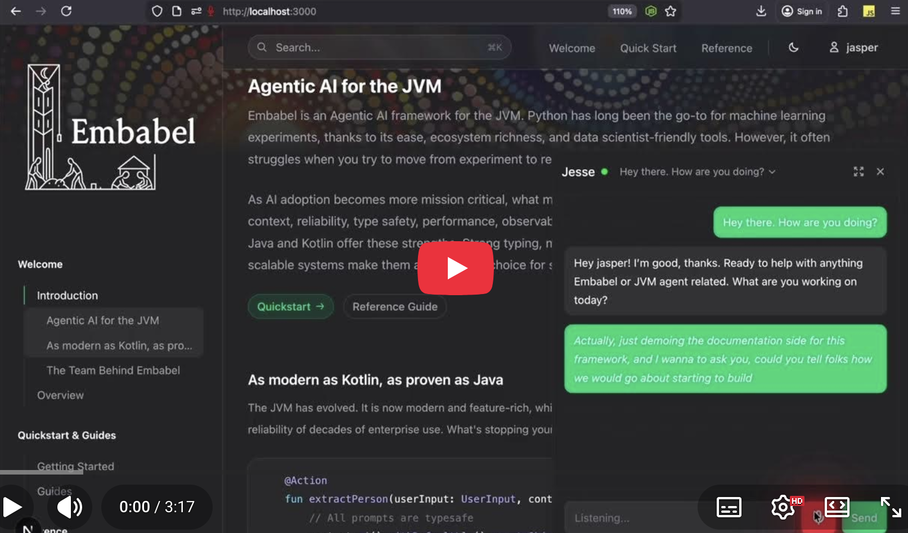

# Embabel Guide : Chat and MCP Server


Guide exposes resources relating to the Embabel Agent Framework, such
as documentation, relevant blogs and other content, and up-to-the-minute API information.

<p align="center">
  
</p>

[](https://www.youtube.com/watch?v=hY6ZFMIJdd4)

This is exposed in two ways:

- Via a chat server (WebSocket/STOMP) for custom front-ends
- Via spring shell
- Via an MCP server for integration with Claude Desktop, Claude Code and
  other MCP clients

**Blog:** [The Voice, The Word, and The Wheel](https://medium.com/embabel/the-voice-the-word-and-the-wheel-d6e2ef2ab26e) — adding voice interaction (TTS/STT) to the Guide with Deepgram, a narrator agent, and natural-language commands.

> **Note:** The chat server and Spring Shell conflict with each other. By default, the chat server is enabled. To use
> Spring Shell instead, uncomment the relevant lines in `pom.xml`.

## Loading data

```bash
curl -X POST http://localhost:1337/api/v1/data/load-references
```

To see stats on data, make a GET request or browse to http://localhost:1337/api/v1/data/stats

RAG content storage uses the `ChunkingContentElementRepository` interface from the `embabel-agent-rag-core` library. The default backend is Neo4j via `DrivineStore`. You can plug in other backends by providing a different `ChunkingContentElementRepository` bean.

## Viewing and Deleting Data

Go to the Neo Browser at http://localhost:7474/browser/

Log in with username `neo4j` and password `brahmsian` (or your custom password if you set one).

To delete all data run the following query:

```cypher

MATCH (n:ContentElement)
DETACH DELETE n
```

## Exposing MCP Tools

Starting the server will expose MCP tools on `http://localhost:1337/sse`.

### Verifying With MCP Inspector (Optional)

An easy way to verify the tools are exposed and experiment with calling them is by running the MCP inspector:

```bash
npx @modelcontextprotocol/inspector
```

Within the inspector UI, connect to `http://localhost:1337/sse`.

## Consuming Embabel MCP Server Tools

- [Claude Desktop](#claude-desktop)
- [Claude Code](#claude-code)
- [Codex](#codex)
- [Cursor](#cursor)
- [Antigravity](#antigravity)
- [Copilot CLI](#copilot-cli)

### Verifying the Server is Running

Before configuring a client, confirm the server is up and returning SSE headers:

```bash
curl -i --max-time 3 http://localhost:1337/sse
```

If you're running the server on a different port (for example `1338`), update the URL accordingly.

### Claude Desktop

Add this stanza to `claude_desktop_config.json`:

```yml
{
  "mcpServers": {

    "embabel-dev": {
      "command": "npx",
      "args": [
        "-y",
        "mcp-remote",
        "http://localhost:1337/sse",
        "--transport",
        "sse-only"
      ]
    },
                  ...
  }
```

See [Connect Local Servers](https://modelcontextprotocol.io/docs/develop/connect-local-servers) for detailed
documentation.

You should create a [Project](https://www.anthropic.com/news/projects) to ensure that Claude knows its purpose and how
to use tools.
See [claude_project.md](docs/claude_project.md) for suggested content.

### Claude Code

If you're using Claude Code, adding the Embabel MCP server will
powerfully augment its capabilities for working on Embabel applications
and helping you learn Embabel.

```bash
claude mcp add embabel --transport sse http://localhost:1337/sse
```

Within the Claude Code shell, type `/mcp` to test the connection. Choose the number of the `embabel` server to check its
status.

Start via `claude --debug` to see more logging.

See [Claude Code MCP documentation](https://code.claude.com/docs/en/mcp) for further information.

#### Auto-Approving Embabel MCP Tools

By default, Claude Code asks for confirmation before running MCP tools. When you accept a tool with "Yes, don't ask
again", Claude Code saves that permission to your local `.claude/settings.local.json` file (which is auto-ignored by
git).

**Note:** Wildcards do not work for MCP tool permissions. Each tool must be approved individually or listed explicitly
in your settings.

**Tool naming:** By default, `guide.toolPrefix` is empty, so MCP tools are exposed with their original names (e.g.,
`mcp__embabel__docs_vectorSearch`). You can set a custom prefix in your application configuration to namespace your
tools.

See [Claude Code Permission Modes](https://code.claude.com/docs/en/iam#permission-modes) for detailed documentation on
how permissions work.

### Codex

Create or update `.codex/config.toml` and add the following MCP server entry:

```toml
[mcp_servers.embabel_guide]
command = "npx"
args = ["-y", "mcp-remote", "http://localhost:1337/sse", "--transport", "sse-only"]
startup_timeout_sec = 60
tool_timeout_sec = 120
```

### Cursor

#### Configuration

Cursor MCP config (Linux):

- `~/.cursor/mcp.json`

Example (recommended: use `mcp-remote` as a stdio bridge for SSE):

```json
{
  "mcpServers": {
    "embabel-dev": {
      "command": "npx",
      "args": [
        "-y",
        "mcp-remote",
        "http://localhost:1337/sse",
        "--transport",
        "sse-only"
      ]
    }
  }
}
```

#### Reload to Reconnect

If you start the server after Cursor is already running, or if the server was temporarily down, Cursor may not
automatically respawn the MCP process. In Cursor:

- **Command Palette** → **Developer: Reload Window**

You should then see the MCP server listed with tools enabled:


### Antigravity

#### Configuration

- Open the MCP store via the "..." dropdown at the top of the editor's agent panel.
- Click on "Manage MCP Servers"
- Click on "View raw config"
- Modify the mcp_config.json with Embabel MCP server configuration.

```json
{
  "mcpServers": {
    "embabel-dev": {
      "command": "npx",
      "args": [
        "-y",
        "mcp-remote",
        "http://localhost:1337/sse",
        "--transport",
        "sse-only"
      ]
    }
  }
}
```

Follow the official instructions for the troubleshooting.
https://antigravity.google/docs/mcp#connecting-custom-mcp-servers

### Copilot CLI

#### Configuration

- Modify the $HOME/.copilot/mcp-config.json with Embabel MCP server configuration

```json
{
  "mcpServers": {
    "embabel-dev": {
      "type": "sse",
      "url": "http://localhost:1337/sse",
      "tools": [
        "*"
      ]
    }
  }
}
```

## Writing a Client

The backend supports any client via WebSocket (for real-time chat) and REST (for authentication).

### WebSocket Chat API

**Endpoint:** `ws://localhost:1337/ws`

Uses STOMP protocol over WebSocket with SockJS fallback. Any STOMP client library works (e.g., `@stomp/stompjs` for
JavaScript, `stomp.py` for Python).

**Authentication:** Pass an optional JWT token as a query parameter:

```
ws://localhost:1337/ws?token=<JWT>
```

If no token is provided, an anonymous user is created automatically.

#### STOMP Channels

| Direction | Destination             | Purpose                       |
|-----------|-------------------------|-------------------------------|
| Subscribe | `/user/queue/messages`  | Receive chat responses        |
| Subscribe | `/user/queue/status`    | Receive typing/status updates |
| Publish   | `/app/chat.sendToJesse` | Send message to AI bot        |
| Publish   | `/app/presence.ping`    | Keep-alive (send every 30s)   |

#### Message Formats

**Sending a message:**

```json
{
  "body": "your message here"
}
```

**Receiving a message:**

```json
{
  "id": "550e8400-e29b-41d4-a716-446655440000",
  "content": "response text",
  "userId": "bot:jesse",
  "userName": "Jesse",
  "timestamp": "2025-12-16T10:30:00Z"
}
```

**Receiving a status update:**

```json
{
  "fromUserId": "bot:jesse",
  "status": "typing"
}
```

### REST API

CORS is open (`*`), no special headers required beyond `Content-Type: application/json`.

#### Authentication Endpoints

**Register:**

```
POST /api/hub/register
{
  "userDisplayName": "Jane Doe",
  "username": "jane",
  "userEmail": "jane@example.com",
  "password": "secret",
  "passwordConfirmation": "secret"
}
```

**Login:**

```
POST /api/hub/login
{ "username": "jane", "password": "secret" }

Response:
{ "token": "eyJhbG...", "userId": "...", "username": "jane", ... }
```

**List Personas:**

```
GET /api/hub/personas
```

**Update Persona** (requires auth):

```
PUT /api/hub/persona/mine
Authorization: Bearer <JWT>
{ "persona": "persona_name" }
```

### Example: Minimal JavaScript Client

```javascript
import {Client} from '@stomp/stompjs';
import SockJS from 'sockjs-client';

const client = new Client({
    webSocketFactory: () => new SockJS('http://localhost:1337/ws'),
    onConnect: () => {
        // Subscribe to responses
        client.subscribe('/user/queue/messages', (frame) => {
            const message = JSON.parse(frame.body);
            console.log('Received:', message.content);
        });

        // Send a message
        client.publish({
            destination: '/app/chat.sendToJesse',
            body: JSON.stringify({body: 'Hello!'})
        });
    }
});

client.activate();
```

## Docker

### Start (Docker Compose)

Start `neo4j` + `guide` (the Java application):

```bash
docker compose --profile java up --build -d
```

#### Docker Build Details

The Dockerfile uses a multi-stage build that compiles the application from source inside the container. This means:

- ✅ Works from a fresh clone (no Java/Maven installation required locally)
- ✅ Only Docker is needed to build and run
- ⚠️ First build takes ~2-3 minutes (Maven compilation inside Docker)

The build process:
1. Stage 1: Uses `maven:3.9.9-eclipse-temurin-21` to compile the application
2. Stage 2: Uses lightweight `eclipse-temurin:21-jre-jammy` runtime image with the compiled JAR

This approach ensures consistency across environments and simplifies onboarding for new contributors.

#### Running Neo4j only (for local Java development)

If you're running the Java application locally (e.g., from your IDE), you can start only Neo4j:

```bash
COMPOSE_PROFILES= docker compose up -d
```

Or equivalently:

```bash
docker compose up neo4j -d
```

This is useful during development when you want faster iteration with your local Java process.

#### Port conflicts

If port `1337` is already in use (for example, the `chatbot` app is running), override the exposed port:

```bash
GUIDE_PORT=1338 docker compose --profile java up --build -d
```

This maps container port `1337` → host port `1338`, so MCP SSE becomes:

- `http://localhost:1338/sse`

#### Compose config overrides

Docker Compose supports environment variable overrides. You can set them inline (shown below) or put them in a local
`.env` file next to `compose.yaml` (Docker Compose auto-loads it).

- **`GUIDE_PORT`**: override host port mapping (default `1337`)
- **`OPENAI_API_KEY`**: required for LLM calls
- **`NEO4J_VERSION` / `NEO4J_USERNAME` / `NEO4J_PASSWORD`**: Neo4j settings (optional)
- **`DISCORD_TOKEN`**: optional, to enable the Discord bot

#### LLM API key

For local/MCP use, the `guide` container needs at least one LLM provider key. Supported providers (in auto-detection order): `OPENAI_API_KEY`, `ANTHROPIC_API_KEY`, `MISTRAL_API_KEY`, `DEEPSEEK_API_KEY`.

For hub/web deployments, no server-side key is needed — users bring their own via **Settings → Integrations**.

1. **Create a `.env` file** next to `compose.yaml`:

```bash
OPENAI_API_KEY=sk-your-key-here
```

2. **Or pass it inline**:

```bash
OPENAI_API_KEY=sk-... docker compose --profile java up --build -d
```

#### Verify MCP

```bash
PORT=${GUIDE_PORT:-1337}
curl -i --max-time 3 "http://localhost:${PORT}/sse"
```

You should see `Content-Type: text/event-stream` and an `event:endpoint` line.

#### Stop

```bash
docker compose --profile java down --remove-orphans
```

### Environment Variables

| Variable           | Default                        | Description                                      |
|--------------------|--------------------------------|--------------------------------------------------|
| `COMPOSE_PROFILES` | `java`                         | Set to empty to run Neo4j only (no Java service) |
| `NEO4J_VERSION`    | `2025.10.1-community-bullseye` | Neo4j Docker image tag                           |
| `NEO4J_USERNAME`   | `neo4j`                        | Neo4j username                                   |
| `NEO4J_PASSWORD`   | `brahmsian`                    | Neo4j password                                   |
| `NEO4J_HTTP_PORT`  | `7474`                         | Neo4j HTTP port                                  |
| `NEO4J_BOLT_PORT`  | `7687`                         | Neo4j Bolt port                                  |
| `NEO4J_HTTPS_PORT` | `7473`                         | Neo4j HTTPS port                                 |
| `OPENAI_API_KEY`   | (optional)                     | OpenAI API key (or any one provider key below)   |
| `ANTHROPIC_API_KEY`| (optional)                     | Anthropic API key                                |
| `MISTRAL_API_KEY`  | (optional)                     | Mistral API key                                  |
| `DEEPSEEK_API_KEY` | (optional)                     | DeepSeek API key                                 |
| `EMBABEL_KEY_SECRET`| (recommended)                 | AES key for BYOK key encryption (`openssl rand -base64 32`) |
| `DISCORD_TOKEN`    | (optional)                     | Discord bot token                                |

Example:

```bash
NEO4J_PASSWORD=mysecretpassword OPENAI_API_KEY=sk-... GUIDE_PORT=1338 docker compose --profile java up --build -d
```

## Testing

### Prerequisites

Tests require the following:

1. **LLM API Key**: Set at least one provider key in your environment before running tests:

```bash
export OPENAI_API_KEY=sk-your-key-here
```

2. **Neo4j**: See the [Local vs CI Testing](#local-vs-ci-testing) section below.

### Local vs CI Testing

The test suite uses Neo4j, which can be provided in two ways:

| Mode                  | `USE_LOCAL_NEO4J` | How Neo4j is provided                       | Best for                           |
|-----------------------|-------------------|---------------------------------------------|------------------------------------|
| **CI (default)**      | unset/`false`     | Testcontainers spins up Neo4j automatically | GitHub Actions, fresh environments |
| **Local development** | `true`            | You run Neo4j via Docker Compose            | Faster iteration                   |

#### For Local Development

For faster test runs during development, use a local Neo4j instance:

1. **Start Neo4j**:

```bash
docker compose up neo4j -d
```

2. **Run tests with `USE_LOCAL_NEO4J=true`**:

```bash
export OPENAI_API_KEY=sk-your-key-here
USE_LOCAL_NEO4J=true ./mvnw test
```

Or add to your shell profile for persistence:

```bash
export USE_LOCAL_NEO4J=true
```

#### For CI

Leave `USE_LOCAL_NEO4J` unset (the default). GitHub Actions uses Testcontainers to automatically spin up Neo4j.

### Running Tests

```bash
./mvnw test
```

All tests should pass, including:

- Hub API controller tests
- User service tests
- Neo4j repository tests
- **MCP Security regression tests** (verifies `/sse` and `/mcp` endpoints are not blocked by Spring Security)

## Miscellaneous

Sometimes (for example if your IDE crashes) you will be left with an orphaned server process and won't be able to
restart.
To kill the server:

```aiignore
lsof -ti:1337 | xargs kill -9
```
